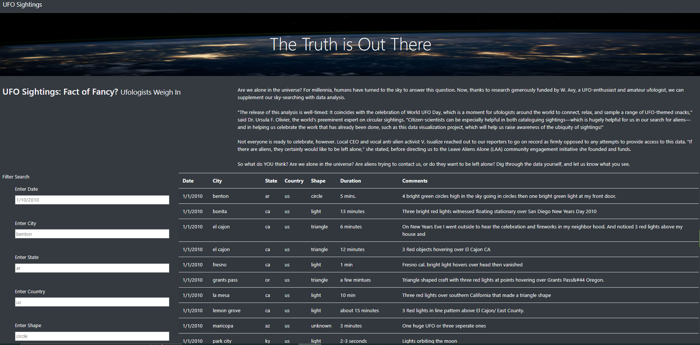
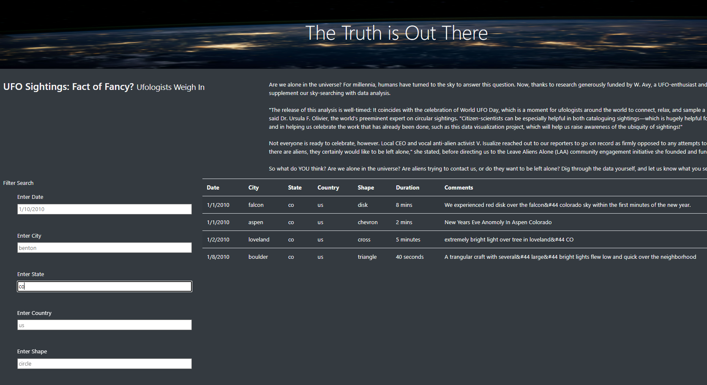

# -UFO Analysis-

## Overview of the UFO Project

### In this project we helped Dana develop her "UFO Sightings" Webpage. We built a webpage that is interactive and dynamic, it accepts users' inputs and visually adjusts to reflect the interactions. We were able to build this by utilizing JavaScript and inserting it into HTML page, we also used our knowledge of CSS and Bootstrap to style the page, as well as some Chrom DevTools to test our code. 

### Dana's initial webpage was already working as intended, and filtered data based on the dates provided by the users, however, she wanted to provide a more in-depth analysis of UFO sightings by allowing users to filter for multiple criteria at the same time. In addition to the date, we added table filters for the city, state, country, and shape.

## Results

### Our code allows us and the users to filter data from the UFO webpage by inputting different filters.
### Users can now browse the webpage and look for results based on date, city, state, country or shape.
### Users can do so by accessing the page from index.html, then under the filter search table, they can specify what they're looking for. Multiple filters could be used at once as well as single filtering.

### The picture below displays all results before filtering:

### While the below screenshot only shows results for the State of Colorado

## Summary

### Drawback:

* A drawback of this webpage is that you can only filter the dates by knowing exactly specific dates for the month of January in 2010, otherwise users would have to leave the "date filter" option blank to showcase all data, then scroll down through all of the dates, this could be improved by including an option to filter by range of date as well. This would only impact a user who is searching by date, if other filters are included then this wouldn't be a major issue.

### Recommendations:

* While the webpage overall looks pretty nice, we could improve its design and style by better utilizing D3.js and CSS.
* The information presented on this webpage, and that was provided to us only covers the month of January in 2010, we could utilize our API knowledge and ETL to create another webpage with more updated data covering more months and years if needed, that would be collected from different datasets, which in return could help other enthusiasts keep up with UFO sightings whenever needed.

